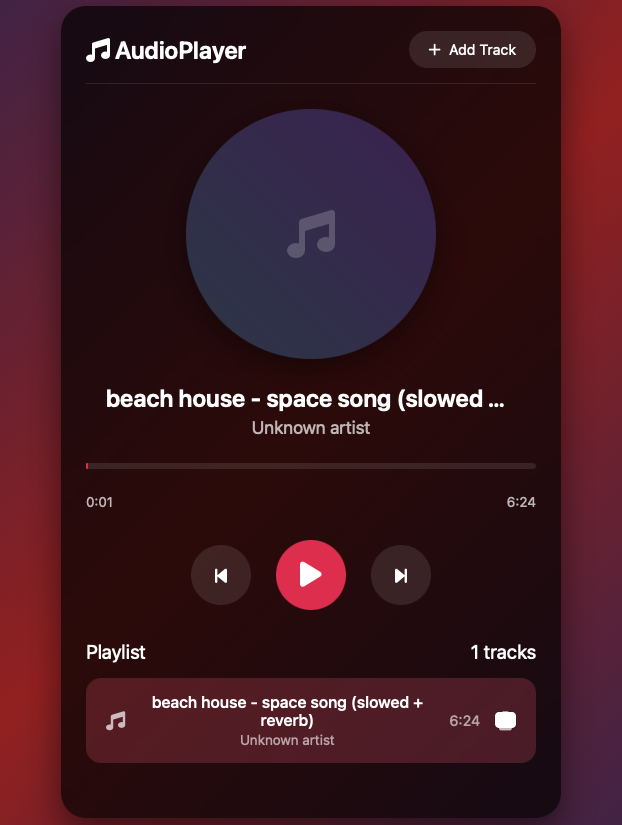

# AudioPlayer Web App

A modern web audio player with the ability to upload and manage your personal music collection directly in your browser. The player uses IndexedDB for local track storage, which requires no server and allows your music to persist between sessions.



---
#### Key Features

*   **Upload Tracks**: Add audio files (mp3, wav, ogg, etc.) directly from your device.
*   **Local Storage**: All tracks are securely stored in your browser using IndexedDB.
*   **Playlist Management**: View, play, and delete tracks from your playlist.
*   **Full Playback Controls**: Play/Pause, Next, Previous.
*   **Intuitive Progress Bar**: Seek through the track by clicking on the progress bar.
*   **Visual Feedback**: Animated album art and highlighting for the current track.
*   **Responsive Design**: Looks great on both desktop and mobile devices (iPhone, Android).
*   **Track Info**: Displays track title, artist, and duration.

---
#### Quick Start

1.  **Download the files**: Save all three files (`index.html`, `style.css`, `main.js`) into a single folder on your computer.
2.  **Open the app**: Simply open the `index.html` file in your browser (Chrome, Firefox, Edge are recommended).
3.  **Add music**: Click the "Add Track" button and select any audio file on your computer.

That's it! Your track will upload, be saved in the browser, and will be ready to play.

---
#### Technologies

*   **HTML5**: Semantic markup and the `<audio>` element.
*   **CSS3**: Modern design using Flexbox, smooth animations, gradients, and the `backdrop-filter` effect.
*   **Vanilla JavaScript**: All logic is written in pure JavaScript without any third-party frameworks.
*   **IndexedDB**: Client-side database for reliable audio file storage.
*   **Font Awesome**: Icons for buttons and UI elements.

---
#### Project Structure

```
audio-player/
│
├── index.html          # Main HTML file
├── style.css           # Application styles
└── main.js             # Core application logic (JavaScript)
```

---
#### How It Works

1.  **Initialization**: Upon page load, the script initializes the IndexedDB database and loads all previously saved tracks.
2.  **File Upload**: When a file is selected, it is read as an `ArrayBuffer` and saved to the database. The track duration is calculated asynchronously.
3.  **Playback**: For playback, the `ArrayBuffer` is converted into a `Blob`, then into a URL, which is passed to the `<audio>` element.
4.  **Interface**: The interface is dynamically updated to reflect the current state of the player (track name, progress, active track in the playlist).

---
#### Design Features

*   **Dark theme** with a gradient background and semi-transparent elements.
*   **Neumorphism and glassmorphism** effect for the main container.
*   **Rotating animation** of the album art during playback.
*   **Custom scrollbar** for the playlist.
*   **Interactive buttons** with hover and active effects.

---
#### Browser Support

The app works best in modern browsers that support:
*   HTML5 Audio API
*   CSS Grid and Flexbox
*   IndexedDB
*   ES6+ (Async/Await, Arrow Functions)

**Google Chrome** or **Mozilla Firefox** are recommended for full functionality.

---
#### Important Notes

*   Tracks are stored **locally in your browser**. If you clear the site data or your browser's cache, your music collection will be deleted.
*   The available storage space depends on your browser and device, but is usually at least 50 MB, and often significantly more.
*   Processing large audio files may take some time.

---
#### Potential Improvements

*   Add the ability to edit metadata (title, artist) for uploaded tracks.
*   Create multiple playlists.
*   Implement Drag & Drop for uploading tracks.
*   Add an audio visualizer.
*   Support for hotkeys (spacebar for play/pause, arrows for seeking).
*   Add a volume control slider.

---
#### License

This project is open source and distributed under the MIT License.

---

**Enjoy your music!** 🎵